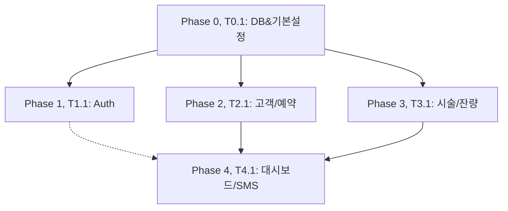

# TASKS: Queens Henna CRM - AI 개발 파트너용 태스크 목록

## MVP 캡슐
1. **목표**: 미용실 원장님이 수기로 관리하던 고객, 시술, 예약, 염색약 재고 관리를 디지털화하여 업무 효율을 높인다. 시술 시 염색약 잔량을 자동 차감하고 부족 시 경고 알람을 띄우는 것이 핵심.
2. **기술 스택**: Next.js (App Router), Prisma, PostgreSQL, Tailwind CSS
3. **사용자**: owner (원장), admin (시스템 관리자)

---

## 마일스톤 개요

| 마일스톤 | 설명 | 주요 기능 |
|----------|------|----------|
| M0 | 프로젝트 셋업 | Phase 0 |
| M1 | 인증 및 역할 시스템 | Phase 1 |
| M2 | 고객 및 예약 관리 | Phase 2 |
| M3 | 시술 및 염색약 잔량 관리 | Phase 3 |
| M4 | 통계, 대시보드 및 알림 | Phase 4 |

---

## M0: 프로젝트 셋업

### [] Phase 0, T0.1: Next.js 및 Database 초기화
**담당**: frontend-specialist, database-specialist

**작업 내용**:
- Next.js (App Router) 보일러플레이트 생성
- Tailwind CSS 및 shadcn/ui 기본 설정, 디자인 토큰 연동
- Prisma 설치 및 `schema.prisma` 작성 (Customer, Treatment, Dye, etc)
- `prisma db push` 실행
- ✅ 현 단계 완료 후 컴파일/빌드 에러 체크 및 검증 (성공 시 다음 단계로 이동)

**산출물**:
- `package.json`
- `prisma/schema.prisma`
- `tailwind.config.ts`

**완료 조건**:
- [ ] Next.js 개발 서버 정상 부팅
- [ ] Postgres DB 스키마 생성 완료
- [ ] CSS 토큰 정상 로드

---

## M1: 인증 및 역할 시스템

### [] Phase 1, T1.1: 로컬 세션 인증 로그인 구현 RED→GREEN
**담당**: backend-specialist

**Git Worktree 설정**:
```bash
git worktree add ../queenshenna-phase1-auth -b phase/1-auth
cd ../queenshenna-phase1-auth
```

**TDD 사이클**:
1. **RED**: 테스트 작성 (실패 확인)
   ```bash
   npm run test tests/api/auth.test.ts # Expected: FAILED
   ```
2. **GREEN**: 구현 (테스트 통과)
   ```bash
   npm run test tests/api/auth.test.ts # Expected: PASSED
   ```
3. **REFACTOR**: 코드 정리 및 보안 로직(BCrypt) 고도화

**산출물**:
- `tests/api/auth.test.ts`
- `app/api/auth/route.ts`

**인수 조건**:
- [ ] 테스트 먼저 작성됨 (RED 확인)
- [ ] 모든 테스트 통과 (GREEN)
- [ ] ✅ 현 단계 완료 후 빌드/실행 에러 체크 및 정상 작동 검증

---

## M2: 고객 및 예약 관리

### [] Phase 2, T2.1: 고객 목록 및 상세 정보 API RED→GREEN
**의존성**: T1.1 (Auth Mock 활용)

**Git Worktree 설정**:
```bash
git worktree add ../queenshenna-phase2-customers -b phase/2-customers
cd ../queenshenna-phase2-customers
```

**Mock 설정**:
- 세션/인증 미들웨어는 Mocking하여 우회

**TDD 사이클**:
1. **RED**: `tests/api/customers.test.ts` 작성 (조회/생성 테스트)
   ```bash
   npm run test tests/api/customers.test.ts # Expected: FAILED
   ```
2. **GREEN**: `app/api/customers/route.ts` 구현
   ```bash
   npm run test tests/api/customers.test.ts # Expected: PASSED
   ```
3. **REFACTOR**: 라우트 미들웨어 및 예외 처리(Zod) 보강

**산출물**:
- `tests/api/customers.test.ts`
- `app/api/customers/route.ts`
- `app/customers/page.tsx` (기존 HTML 포팅)

**인수 조건**:
- [ ] 테스트 먼저 작성됨 (RED 확인)
- [ ] 모든 테스트 통과 (GREEN)
- [ ] ✅ 현 단계 완료 후 빌드/실행 에러 체크 및 정상 작동 검증

---

## M3: 시술 및 염색약 잔량 관리

### [] Phase 3, T3.1: 시술 등록 시 자동 차감 트랜잭션 로직 RED→GREEN
**담당**: backend-specialist

**Git Worktree 설정**:
```bash
git worktree add ../queenshenna-phase3-treatment -b phase/3-treatment
cd ../queenshenna-phase3-treatment
```

**TDD 사이클**:
1. **RED**: `tests/services/treatmentService.test.ts` 작성
   ```bash
   npm run test tests/services/treatmentService.test.ts # Expected: FAILED
   ```
2. **GREEN**: `services/treatmentService.ts` 구현 (Prisma $transaction 사용, 잔액 차감 로직 반영)
   ```bash
   npm run test tests/services/treatmentService.test.ts # Expected: PASSED
   ```
3. **REFACTOR**: 차감 한도 초과(에러 방어) 및 예외 상태 롤백 처리 수정

**산출물**:
- `tests/services/treatmentService.test.ts`
- `services/treatmentService.ts`
- `app/api/treatments/route.ts`

**인수 조건**:
- [ ] 테스트 먼저 작성됨 (RED 확인)
- [ ] 모든 테스트 통과 (GREEN)
- [ ] 염색약 잔량 정상 차감 테스트 통과
- [ ] ✅ 현 단계 완료 후 빌드/실행 에러 체크 및 검증

---

## M4: 통계, 대시보드 및 기타

### [] Phase 4, T4.1: 대시보드 메인 API 구축 RED→GREEN
**의존성**: T2.1, T3.1 (고객/시술 데이터 기반)

**Git Worktree 설정**:
```bash
git worktree add ../queenshenna-phase4-dashboard -b phase/4-dashboard
cd ../queenshenna-phase4-dashboard
```

**TDD 사이클**:
1. **RED**: `tests/api/dashboard.test.ts` 
   ```bash
   npm run test tests/api/dashboard.test.ts # Expected: FAILED
   ```
2. **GREEN**: `app/api/dashboard/route.ts` 통계 쿼리 구현
   ```bash
   npm run test tests/api/dashboard.test.ts # Expected: PASSED
   ```
3. **REFACTOR**: 불필요한 쿼리 Join 최적화

**산출물**:
- `tests/api/dashboard.test.ts`
- `app/api/dashboard/route.ts`
- `app/dashboard/page.tsx`

**인수 조건**:
- [ ] 모든 테스트 통과 (GREEN)
- [ ] 프론트엔드 모바일 반응형 검증
- [ ] ✅ 현 단계 완료 후 빌드/실행 에러 체크 및 검증

---

## 병렬 실행 가능 태스크

| 태스크 ID | 의존하는 태스크 | 비고 |
|-----------|----------------|------|
| T0.1 | 없음 | 가장 먼저 실행되어야 함 |
| T1.1 | T0.1 완료 후 | |
| T2.1 | T0.1 완료 후 | T1.1과 Mock을 써서 병렬 개발 가능 |
| T3.1 | T0.1 완료 후 | |
| T4.1 | T2.1, T3.1 완료 후 | 통합 지표가 필요하므로 이후에 배치 |

---

## 의존성 그래프



---

## 완료 후 동작

TASKS.md 생성이 완료되었습니다!

이제 프로젝트 환경을 셋업할까요?

1. 예 - 에이전트 팀 + 프로젝트 구조 생성 (`/project-bootstrap` 기반 보일러플레이트 세팅)
2. 아니오 - 기획 문서만 먼저 검토하겠습니다
