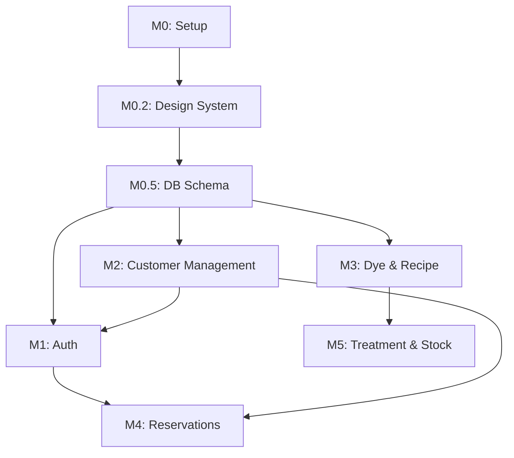

# TASKS: 퀸즈헤나 고객관리 앱 - AI 개발 파트너용 태스크 목록

## MVP 컨셉
1. **목표**: 퀸즈헤나 염색 전문점의 고객, 예약, 시술, 염색약 잔량, 매출 통합 관리
2. **페르소나**: 원장님 (고객/시술/잔량 관리), 시스템 관리자 (시스템 설정/백업)
3. **핵심 가치**: `designs/` 폴더의 HTML 템플릿을 기반으로 한 고품격 UI 구현
4. **기술 스택**: Next.js 14, Supabase, Tailwind CSS, shadcn/ui, Pretendard Font
5. **데이터 가시성**: 대시보드를 통한 오늘 예약 및 염색약 부족 고객 즉시 확인
6. **신뢰성**: 로컬 JSON 백업/복원 지원 및 DB 트리거를 이용한 데이터 정합성 보장
7. **확장성**: SMS 연동 및 매출 통계 고도화 (2차 개발 예정)
8. **제약 사항**: 모든 비즈니스 로직은 서버 액션 또는 DB RPC/트리거로 처리 (Prisma 미사용)
9. **품질 기준**: 모든 핵심 로직에 대해 TDD 적용 (Phase 1+)
10. **다음 단계**: 프로젝트 셋업 및 디자인 시스템 이식

---

## 마일스톤 개요

| 마일스톤 | 설명 | 주요 기능 | Phase |
|----------|------|----------|-------|
| M0 | 프로젝트 셋업 | [x] 환경 설정, 디렉토리 구조, shadcn/ui 초기화 | Phase 0 |
| M0.2 | 디자인 시스템 이식 | [x] `designs/` 기반 CSS 변수, 폰트, 아이콘 설정 | Phase 0 |
| M0.5 | DB & Configuration | [x] Supabase 스키마, 타입 생성, RLS 정책 | Phase 0 |
| M1 | 인증 및 보안 | Supabase Auth 로그인 구현, 경로 보호 | Phase 1 |
| M2 | 고객 관리 | `customers.html` 기반 UI 이식 및 CRUD | Phase 2 |
| M3 | 염색약 및 레시피 | `inventory.html` 기반 UI 이식 및 자산 관리 | Phase 3 |
| M4 | 예약 관리 | `reservations.html` 기반 UI 이식 및 일정 로직 | Phase 4 |
| M5 | 시술 및 자동 정산 | `treatment-register.html` 기반 UI 및 RPC 연동 | Phase 5 |
| M6 | 백업 및 설정 | `settings.html` 기반 UI 및 JSON 백업 구현 | Phase 6 |
| M7 | 대시보드 및 통계 | `dashboard.html`, `sales.html` 기반 UI 이식 | Phase 7 |

---

## M0: 프로젝트 셋업

### [x] Phase 0, T0.1: Next.js 프로젝트 초기화
**담당**: frontend-specialist
**작업 내용**:
- Next.js 16 (App Router) 초기화
- Tailwind CSS 4 설정
**검증 계획**:
- `npm run dev` 실행 시 에러 없이 구동 확인
- `package.json`의 필수 의존성 설치 여부 확인
**산출물**: `package.json`, `app/layout.tsx`

### [x] Phase 0, T0.2: 디자인 시스템 이식 및 공통 레이아웃
**담당**: frontend-specialist
**작업 내용**:
- `designs/dashboard.html`의 CSS 변수를 `globals.css` 및 `tailwind.config.js`에 이식
- Pretendard 폰트 및 Phosphor Icons 설정
- 사이드바(`Sidebar`) 및 기본 레이아웃 컴포넌트 구현
**검증 계획**:
- 브라우저 검사를 통해 CSS 변수 값이 디자인 가이드와 일치하는지 확인
- 아이콘 렌더링 및 폰트 적용 여부 육안 확인
**산출물**: `tailwind.config.js`, `components/layout/Sidebar.tsx`

---

## M0.5: DB & 설정

### [x] Phase 0, T0.5.1: Supabase DB 스키마 설계 및 Migration
**담당**: database-specialist
**작업 내용**:
- TRD의 SQL 스펙을 기반으로 초기 마이그레이션 작성 (완료)
- RLS 정책 및 염색약 잔량 계산 트리거 포함 (완료)
**검증 계획**:
- SQL 구문 오류 확인 (완료)
- 모든 테이블 및 외래키 제약 조건 설정 확인 (완료)
**산출물**: `supabase/migrations/0001_initial_schema.sql`

### [x] Phase 0, T0.5.2: Supabase 유틸리티 구현
**담당**: frontend-specialist
**작업 내용**:
- `lib/supabase/client.ts`, `server.ts`, `middleware.ts` 구현 (완료)
- Next.js 전역 `middleware.ts` 연동 (완료)
**산출물**: `lib/supabase/*.ts`, `middleware.ts`

---

## M1: 인증 및 보안

### [x] Phase 1, T1.1: Supabase Auth 로그인 구현 (RED-GREEN)
**담당**: frontend-specialist
**Git Worktree 설정**: `git worktree add ../project-phase1-auth -b phase/1-auth`
**TDD 사이클**:
1. **RED**: `tests/auth/login.test.ts` 작성 (완료)
2. **GREEN**: 로그인 페이지 및 서버 액션 구현 (완료)
3. **REFACTOR**: 에러 처리 보강 및 UI 리팩토링 (완료)
**검증 계획 (Error Checking)**:
- **자동 검증**: `npm test tests/auth/login.test.ts` 실행 (성공/실패 시나리오 전체 PASS 확인)
- **에러 체크**: 잘못된 비밀번호 입력 시 사용자에게 명확한 에러 메시지(Toast 등) 출력 확인
- **수동 검증**: 로그인 후 세션 유지 및 미들웨어 페이지 보호 동작 확인
**산출물**: `app/(auth)/login/page.tsx`

---

## M2: 고객 관리
### [x] Phase 2, T2.1: 고객 목록 UI 이식 및 조회 (RED-GREEN)
**담당**: frontend-specialist
**디자인 소스**: `designs/customers.html`
**Git Worktree 설정**:
```bash
git worktree add ../project-phase2-customers -b phase/2-customers
cd ../project-phase2-customers
```
**TDD 사이클**:
1. **RED**: `tests/customers/CustomerList.test.tsx` 작성
2. **GREEN**: `customers.html` 디자인을 React로 이식하고 데이터 연동
3. **REFACTOR**: 공통 `DataTable` 컴포넌트 추출
**산출물**: `app/customers/page.tsx`, `components/customers/CustomerTable.tsx`

### [x] Phase 2, T2.2: 신규 고객 등록 폼 및 유효성 검사 (RED-GREEN)
**담당**: frontend-specialist
**디자인 소스**: `designs/customers.html` (모달/페이지 유추)
**작업 내용**:
- 고객명, 연락처, 생년월일, 메모 필드 구현
- 필수값 유효성 검사 적용
**TDD 사이클**:
1. **RED**: `tests/customers/CustomerRegister.test.tsx` 작성
2. **GREEN**: `app/customers/register/page.tsx` 또는 모달로 구현 및 Supabase 저장 연동
**산출물**: `app/customers/register/page.tsx`

### [x] Phase 2, T2.3: 고객 상세 정보 조회 및 수정 (RED-GREEN)
**담당**: frontend-specialist
**작업 내용**:
- 고객별 시술 이력 및 잔량 상세 열람
- 기본 정보 수정 기능 구현
**TDD 사이클**:
1. **RED**: `tests/customers/CustomerDetail.test.tsx` 작성
2. **GREEN**: `app/customers/[id]/page.tsx` 상세 정보 및 수정 폼 구현
**산출물**: `app/customers/[id]/page.tsx`

---

## M3: 염색약 및 레시피 관리
### [x] Phase 3, T3.1: 염색약 현황 UI 이식 및 조회 (RED-GREEN)
**담당**: frontend-specialist
**디자인 소스**: `designs/inventory.html`
**작업 내용**:
- 전체 염색약 재고 목록 조회
- 실시간 잔량 경고 필터링
**산출물**: `app/inventory/page.tsx`

### [x] Phase 3, T3.2: 염색약 구매/보충 등록 폼 구현 (RED-GREEN)
**담당**: frontend-specialist
**작업 내용**:
- 고객별 염색약 구매 내역 등록
- 기존 재고 합산 로직 (Upsert)
**TDD 사이클**:
1. **RED**: `tests/inventory/InventoryRegister.test.tsx` 작성
2. **GREEN**: `app/inventory/register/page.tsx` 및 서버 액션 구현
**산출물**: `app/inventory/register/page.tsx`, `app/inventory/actions.ts`

---

## M4: 예약 관리
### [x] Phase 4, T4.1: 예약 캘린더 UI 이식 및 관리 (RED-GREEN)
**담당**: frontend-specialist
**디자인 소스**: `designs/reservations.html`
**작업 내용**:
- [x] 예약 현황 캘린더/리스트 뷰 UI 구현 (`ReservationTimeline`)
- [x] 예약 현황 조회 테스트 코드 작성 및 통과
- [x] Supabase 예약 데이터 연동 (`getReservationsByDate`)
**산출물**: `app/reservations/page.tsx`, `components/reservations/ReservationTimeline.tsx`, `app/reservations/actions.ts`

### [x] Phase 4, T4.2: 예약 등록 폼 구현 (RED-GREEN)
- [x] 예약 등록 폼 UI 개발 (`ReservationForm`)
- [x] 고객 검색 연동 (`searchCustomers`)
- [x] 예약 등록 서버 액션 구현 (`createReservation`)
**산출물**: `components/reservations/ReservationForm.tsx`

### [x] Phase 5, T5.1: 시술 등록 UI 이식 및 RPC 연동 (RED-GREEN)
**담당**: frontend-specialist / database-specialist
**디자인 소스**: `designs/treatment-register.html`
**작업 내용**:
- [x] 시술 등록 폼 UI 개발 및 검색 연동 (`TreatmentForm`)
- [x] 시술 등록 및 재고 차감 RPC 구현 (`register_treatment`)
- [x] 시술 등록 서버 액션 연동 및 테스트 통과
**산출물**: `app/treatments/page.tsx`, `components/treatments/TreatmentForm.tsx`, `supabase/migrations/0003_add_treatment_logic.sql`

### [x] Phase 5, T5.2: 고객 레시피(최근 시술 내역) 불러오기 및 저장 (RED-GREEN)
- [x] 전회 시술 데이터 조회 서버 액션 구현 (`getLatestTreatmentUsage`)
- [x] 기본 레시피 자동 로드 및 저장 기능 구현 (`saveDefaultRecipe`, `getDefaultRecipe`)
- [x] UI 연동 및 테스트 완료
**산출물**: `app/treatments/actions.ts`, `components/treatments/TreatmentForm.tsx`

### [x] Phase 6, T6.1: 설정 및 데이터 백업/복원 구현 (RED-GREEN)
- [x] `settings.html` 기반 UI 개발 및 탭 네비게이션 구현
- [x] 전체 DB 테이블 JSON 백업 기능 구현 (`getBackupData`)
- [x] JSON 파일 업로드 및 데이터 복원 기능 구현 (`restoreData`)
**산출물**: `app/settings/page.tsx`, `app/settings/actions.ts`

---

## 의존성 그래프


### [x] Phase 7, T7.1: 대시보드 UI 이식 및 실시간 통계 연동 (RED-GREEN)
- [x] `dashboard.html` 기반 메인 UI 및 KPI 카드 구현
- [x] 오늘 예약, 매출, 신규 고객, 저재고 알림 실시간 데이터 로드
- [x] `app/dashboard/actions.ts`를 통한 데이터 집계 로직 구현
**산출물**: `app/page.tsx`, `app/dashboard/actions.ts`

### [x] Phase 7, T7.2: 매출 통계 페이지 및 일자별 집계 구현 (RED-GREEN)
- [x] `sales.html` 기반 매출 상세 UI 구현
- [x] 일자별 매출 추이 시각화 (CSS/SVG 기반) 및 데이터 테이블 구현
- [x] 월별 필터링 및 카드/현금 비율 계산 로직 연동
**산출물**: `app/sales/page.tsx`, `app/sales/actions.ts`

---

## 병렬 실행 가능 태스크
| 태스크 ID | 병렬 가능 여부 | 선행 조건 |
|-----------|----------------|-----------|
| T1.1 (Auth) | 가능 | T0.5 완료 |
| T2.1 (Customer UI) | 가능 | T0.2 완료 |
| T3.1 (Dye UI) | 가능 | T0.2 완료 |
| T6.1 (Settings UI) | 가능 | T0.2 완료 |

**TASKS.md 업데이트가 완료되었습니다.**

---

## ──────────────────────────────────────────
## 📌 Phase 8 — 안정화 & 고도화 (2026-04-14 역분석 추가)
## ──────────────────────────────────────────
> **역분석 기준일**: 2026-04-14
> **현재 브랜치 상태**: 대규모 수정 커밋 미완료 (git status 참조)
> **신규 컴포넌트**: CustomerRecipePanel, DyeMasterPanel, BottomNav, PageTransition, WeeklyView, TreatmentCompletionForm, Skeleton, StaggerList
> **신규 훅**: useCountUp, useScrollGlass, useTiltEffect
> **신규 마이그레이션**: 0004~0008 (로컬 파일 존재, Supabase 적용 여부 미확인)

### [x] Phase 8, T8.1: Auth Middleware 복원 🔴 최우선
**우선순위**: CRITICAL — `middleware.ts` 삭제로 라우트 보호 미작동
**작업 내용**:
- `middleware.ts` 재생성: Supabase SSR 세션 갱신 + 미인증 사용자 `/login` 리다이렉트
- `lib/supabase/middleware.ts` 확인 후 연동
**검증**:
- 미로그인 상태에서 `/customers` 접근 시 `/login`으로 리다이렉트 확인
**산출물**: `middleware.ts`

### [ ] Phase 8, T8.2: 신규 DB 마이그레이션 Supabase 적용 🔴 최우선
**우선순위**: HIGH — DyeMasterPanel, TreatmentCompletionForm 기능의 전제 조건
**마이그레이션 목록 (순서 준수)**:
1. `0004_update_dye_types_schema.sql` — dye_types에 `total_capacity`, `default_unit_id`, `is_active` 추가
2. `0005_link_reservations_treatments.sql` — treatments에 `reservation_id`, `treatment_usage` 테이블
3. `0006_rename_reservation_status.sql` — 예약 상태값 표준화
4. `0007_fix_register_treatment_rpc.sql` — register_treatment RPC 갱신
5. `0008_fix_status_criteria.sql` — 상태 기준 재정의
**검증**:
- Supabase 대시보드 또는 `npx supabase db push`로 적용 확인
- `dye_types` 테이블에 `is_active` 컬럼 존재 확인
**산출물**: Supabase DB 업데이트

### [ ] Phase 8, T8.3: 테스트 커버리지 확장
**우선순위**: MEDIUM

#### T8.3.1: 예약 추가 테스트
**TDD 사이클**:
1. **RED**: `tests/reservations/WeeklyView.test.tsx` 작성 — 주간 뷰 렌더링, 날짜 이동
2. **RED**: `tests/reservations/ReservationForm.test.tsx` 작성 — 고객 검색, 폼 제출
3. **GREEN**: 테스트 통과 확인
**산출물**: `tests/reservations/WeeklyView.test.tsx`, `tests/reservations/ReservationForm.test.tsx`

#### T8.3.2: 시술 완료 처리 테스트
**TDD 사이클**:
1. **RED**: `tests/treatments/TreatmentCompletion.test.tsx` 작성 — 예약 선택, 사용량 입력, RPC 호출
2. **GREEN**: `TreatmentCompletionForm` 연동 확인
**산출물**: `tests/treatments/TreatmentCompletion.test.tsx`

#### T8.3.3: 고객 레시피 패널 테스트
**TDD 사이클**:
1. **RED**: `tests/customers/CustomerRecipePanel.test.tsx` 작성 — 레시피 표시, 수정
2. **GREEN**: `CustomerRecipePanel` 연동 확인
**산출물**: `tests/customers/CustomerRecipePanel.test.tsx`

#### T8.3.4: 재고 마스터 패널 테스트
**TDD 사이클**:
1. **RED**: `tests/inventory/DyeMaster.test.tsx` 작성 — 염색약 CRUD, is_active 토글
2. **GREEN**: `DyeMasterPanel` 연동 확인
**산출물**: `tests/inventory/DyeMaster.test.tsx`

### [x] Phase 8, T8.4: 접근성 개선
**우선순위**: MEDIUM
**작업 내용**:
- 모든 아이콘 버튼에 `aria-label` 추가 (Sidebar, BottomNav, 각 액션 버튼)
- `<main>`, `<nav>`, `<section>` 시멘틱 마크업 적용
- 포커스 링 스타일 개선 (`focus-visible:ring-2 focus-visible:ring-primary`)
- Sheet/모달 ESC 닫기, 탭 순서 최적화
**산출물**: 각 layout/ui 컴포넌트 업데이트

### [ ] Phase 8, T8.5: 디자인 고도화 (기획.md 10가지 항목)
**우선순위**: LOW — 기능 안정화 후 진행
**참조**: `docs/디자인개선 기획.md`
**작업 내용**:
- [ ] ① 아이콘 두께 `weight="bold"` 일관 적용, 인터랙션 색상 전환
- [ ] ② 숫자 데이터에 Montserrat/Inter 혼용 (`font-feature-settings: "tnum"`)
- [ ] ③ Framer Motion StaggerList — 이미 구현됨, 누락 페이지에 추가 적용
- [ ] ④ Glassmorphism — 이미 구현됨, 모든 sticky 헤더에 일관 적용
- [ ] ⑤ 비대칭 Bento Grid — 대시보드 KPI 레이아웃 col-span 최적화
- [ ] ⑥ Skeleton UI — 누락 페이지(고객 상세, 재고) 추가 적용
- [ ] ⑦ 3D Tilt & Spotlight — KpiCard 외 다른 카드에도 확장
- [ ] ⑧ Counting Animation — 이미 구현됨 (useCountUp)
- [ ] ⑨ 모바일 BottomNav — 이미 구현됨, 활성 탭 표시 정확도 확인
- [ ] ⑩ SEO 메타데이터 — 각 page.tsx에 `metadata` export 추가
**산출물**: 각 컴포넌트 업데이트

---

## Phase 9 — 배포 준비

### [ ] Phase 9, T9.1: 환경변수 검증 및 빌드 통과
**작업 내용**:
- `.env.local` 필수 키 확인: `NEXT_PUBLIC_SUPABASE_URL`, `NEXT_PUBLIC_SUPABASE_ANON_KEY`
- `npm run build` 오류 0개 달성
- `npm run test` 전체 통과
**커맨드**:
```bash
npm run test && npm run build && npm run lint
```
**산출물**: 빌드 성공 및 테스트 그린

---

## Phase 8~9 의존성 그래프

```
T8.1 (Auth Middleware) ← 즉시 작업
T8.2 (DB Migration)   ← 즉시 작업 (T8.1과 병렬 가능)
  ↓
T8.3 (테스트) ← T8.1, T8.2 완료 후
T8.4 (접근성) ← T8.3과 병렬 가능
  ↓
T8.5 (디자인 고도화)
  ↓
T9.1 (배포 준비)
```

## 현재 권장 작업 순서

| 순위 | 태스크 | 이유 |
|------|--------|------|
| 1 | T8.1 Auth Middleware 복원 | 보안 — 모든 라우트 무보호 |
| 2 | T8.2 DB 마이그레이션 적용 | DyeMaster/시술완료 기능 전제 |
| 3 | T8.3 테스트 작성 | 안정성 + TDD 원칙 |
| 4 | T8.4 접근성 | 사용성 |
| 5 | T8.5 디자인 고도화 | 프리미엄 UX |
| 6 | T9.1 배포 준비 | 릴리스 |
