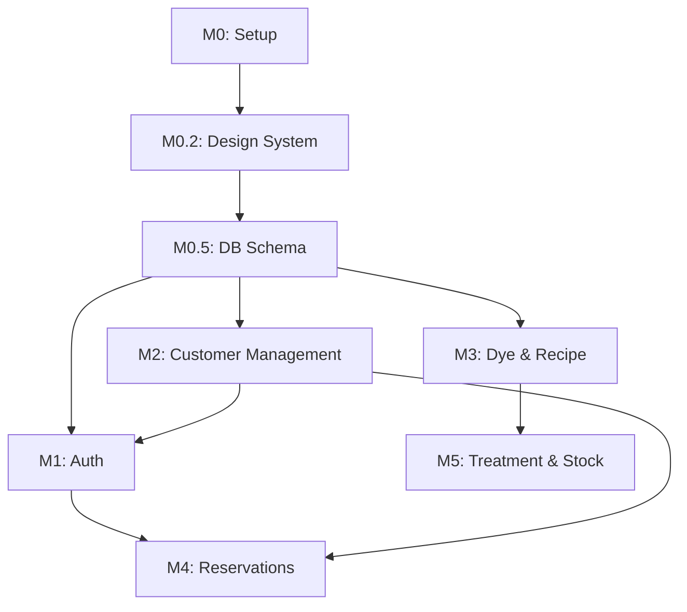

# TASKS: 퀸즈헤나 고객관리 앱 - AI 개발 파트너용 태스크 목록

## MVP 컨셉
1. **목표**: 퀸즈헤나 염색 전문점의 고객, 예약, 시술, 염색약 잔량, 매출 통합 관리
2. **페르소나**: 원장님 (고객/시술/잔량 관리), 시스템 관리자 (시스템 설정/백업)
3. **핵심 가치**: `designs/` 폴더의 HTML 템플릿을 기반으로 한 고품격 UI 구현
4. **기술 스택**: Next.js 14, Supabase, Tailwind CSS, shadcn/ui, Pretendard Font
5. **데이터 가시성**: 대시보드를 통한 오늘 예약 및 염색약 부족 고객 즉시 확인
6. **신뢰성**: 로컬 JSON 백업/복원 지원 및 DB 트리거를 이용한 데이터 정합성 보장
7. **확장성**: SMS 연동 및 매출 통계 고도화 (2차 개발 예정)
8. **제약 사항**: 모든 비즈니스 로직은 서버 액션 또는 DB RPC/트리거로 처리 (Prisma 미사용)
9. **품질 기준**: 모든 핵심 로직에 대해 TDD 적용 (Phase 1+)
10. **다음 단계**: 프로젝트 셋업 및 디자인 시스템 이식

---

## 마일스톤 개요

| 마일스톤 | 설명 | 주요 기능 | Phase |
|----------|------|----------|-------|
| M0 | 프로젝트 셋업 | [x] 환경 설정, 디렉토리 구조, shadcn/ui 초기화 | Phase 0 |
| M0.2 | 디자인 시스템 이식 | [x] `designs/` 기반 CSS 변수, 폰트, 아이콘 설정 | Phase 0 |
| M0.5 | DB & Configuration | [x] Supabase 스키마, 타입 생성, RLS 정책 | Phase 0 |
| M1 | 인증 및 보안 | Supabase Auth 로그인 구현, 경로 보호 | Phase 1 |
| M2 | 고객 관리 | `customers.html` 기반 UI 이식 및 CRUD | Phase 2 |
| M3 | 염색약 및 레시피 | `inventory.html` 기반 UI 이식 및 자산 관리 | Phase 3 |
| M4 | 예약 관리 | `reservations.html` 기반 UI 이식 및 일정 로직 | Phase 4 |
| M5 | 시술 및 자동 정산 | `treatment-register.html` 기반 UI 및 RPC 연동 | Phase 5 |
| M6 | 백업 및 설정 | `settings.html` 기반 UI 및 JSON 백업 구현 | Phase 6 |
| M7 | 대시보드 및 통계 | `dashboard.html`, `sales.html` 기반 UI 이식 | Phase 7 |

---

## M0: 프로젝트 셋업

### [x] Phase 0, T0.1: Next.js 프로젝트 초기화
**담당**: frontend-specialist
**작업 내용**:
- Next.js 16 (App Router) 초기화
- Tailwind CSS 4 설정
**검증 계획**:
- `npm run dev` 실행 시 에러 없이 구동 확인
- `package.json`의 필수 의존성 설치 여부 확인
**산출물**: `package.json`, `app/layout.tsx`

### [x] Phase 0, T0.2: 디자인 시스템 이식 및 공통 레이아웃
**담당**: frontend-specialist
**작업 내용**:
- `designs/dashboard.html`의 CSS 변수를 `globals.css` 및 `tailwind.config.js`에 이식
- Pretendard 폰트 및 Phosphor Icons 설정
- 사이드바(`Sidebar`) 및 기본 레이아웃 컴포넌트 구현
**검증 계획**:
- 브라우저 검사를 통해 CSS 변수 값이 디자인 가이드와 일치하는지 확인
- 아이콘 렌더링 및 폰트 적용 여부 육안 확인
**산출물**: `tailwind.config.js`, `components/layout/Sidebar.tsx`

---

## M0.5: DB & 설정

### [x] Phase 0, T0.5.1: Supabase DB 스키마 설계 및 Migration
**담당**: database-specialist
**작업 내용**:
- TRD의 SQL 스펙을 기반으로 초기 마이그레이션 작성 (완료)
- RLS 정책 및 염색약 잔량 계산 트리거 포함 (완료)
**검증 계획**:
- SQL 구문 오류 확인 (완료)
- 모든 테이블 및 외래키 제약 조건 설정 확인 (완료)
**산출물**: `supabase/migrations/0001_initial_schema.sql`

### [x] Phase 0, T0.5.2: Supabase 유틸리티 구현
**담당**: frontend-specialist
**작업 내용**:
- `lib/supabase/client.ts`, `server.ts`, `middleware.ts` 구현 (완료)
- Next.js 전역 `middleware.ts` 연동 (완료)
**산출물**: `lib/supabase/*.ts`, `middleware.ts`

---

## M1: 인증 및 보안

### [x] Phase 1, T1.1: Supabase Auth 로그인 구현 (RED-GREEN)
**담당**: frontend-specialist
**Git Worktree 설정**: `git worktree add ../project-phase1-auth -b phase/1-auth`
**TDD 사이클**:
1. **RED**: `tests/auth/login.test.ts` 작성 (완료)
2. **GREEN**: 로그인 페이지 및 서버 액션 구현 (완료)
3. **REFACTOR**: 에러 처리 보강 및 UI 리팩토링 (완료)
**검증 계획 (Error Checking)**:
- **자동 검증**: `npm test tests/auth/login.test.ts` 실행 (성공/실패 시나리오 전체 PASS 확인)
- **에러 체크**: 잘못된 비밀번호 입력 시 사용자에게 명확한 에러 메시지(Toast 등) 출력 확인
- **수동 검증**: 로그인 후 세션 유지 및 미들웨어 페이지 보호 동작 확인
**산출물**: `app/(auth)/login/page.tsx`

---

## M2: 고객 관리
### [x] Phase 2, T2.1: 고객 목록 UI 이식 및 조회 (RED-GREEN)
**담당**: frontend-specialist
**디자인 소스**: `designs/customers.html`
**Git Worktree 설정**:
```bash
git worktree add ../project-phase2-customers -b phase/2-customers
cd ../project-phase2-customers
```
**TDD 사이클**:
1. **RED**: `tests/customers/CustomerList.test.tsx` 작성
2. **GREEN**: `customers.html` 디자인을 React로 이식하고 데이터 연동
3. **REFACTOR**: 공통 `DataTable` 컴포넌트 추출
**산출물**: `app/customers/page.tsx`, `components/customers/CustomerTable.tsx`

### [x] Phase 2, T2.2: 신규 고객 등록 폼 및 유효성 검사 (RED-GREEN)
**담당**: frontend-specialist
**디자인 소스**: `designs/customers.html` (모달/페이지 유추)
**작업 내용**:
- 고객명, 연락처, 생년월일, 메모 필드 구현
- 필수값 유효성 검사 적용
**TDD 사이클**:
1. **RED**: `tests/customers/CustomerRegister.test.tsx` 작성
2. **GREEN**: `app/customers/register/page.tsx` 또는 모달로 구현 및 Supabase 저장 연동
**산출물**: `app/customers/register/page.tsx`

### [x] Phase 2, T2.3: 고객 상세 정보 조회 및 수정 (RED-GREEN)
**담당**: frontend-specialist
**작업 내용**:
- 고객별 시술 이력 및 잔량 상세 열람
- 기본 정보 수정 기능 구현
**TDD 사이클**:
1. **RED**: `tests/customers/CustomerDetail.test.tsx` 작성
2. **GREEN**: `app/customers/[id]/page.tsx` 상세 정보 및 수정 폼 구현
**산출물**: `app/customers/[id]/page.tsx`

---

## M3: 염색약 및 레시피 관리
### [x] Phase 3, T3.1: 염색약 현황 UI 이식 및 조회 (RED-GREEN)
**담당**: frontend-specialist
**디자인 소스**: `designs/inventory.html`
**작업 내용**:
- 전체 염색약 재고 목록 조회
- 실시간 잔량 경고 필터링
**산출물**: `app/inventory/page.tsx`

---

## M4: 예약 관리
### [] Phase 4, T4.1: 예약 캘린더 UI 이식 및 관리 (RED-GREEN)
**담당**: frontend-specialist
**디자인 소스**: `designs/reservations.html`
**작업 내용**:
- 예약 현황 캘린더/리스트 뷰 구현
- 신규 예약 등록 및 상태 변경 (예약완료 -> 방문완료)
**산출물**: `app/reservations/page.tsx`

---

## M5: 시술 및 자동 정산

### [] Phase 5, T5.1: 시술 등록 UI 이식 및 RPC 연동 (RED-GREEN)
**담당**: frontend-specialist / database-specialist
**디자인 소스**: `designs/treatment-register.html`
**Git Worktree 설정**:
```bash
git worktree add ../project-phase5-treatment -b phase/5-treatment
cd ../project-phase5-treatment
```
**TDD 사이클**:
1. **RED**: `tests/treatments/TreatmentRegister.test.tsx` 작성
2. **GREEN**: `treatment-register.html` UI 이식 및 `save_treatment_with_dye` RPC 호출 연동
3. **REFACTOR**: 폼 유효성 검사 및 에러 처리 정리
**산출물**: `app/treatments/register/page.tsx`, `lib/api/treatment.ts`

---

## 의존성 그래프


---

## 병렬 실행 가능 태스크
| 태스크 ID | 병렬 가능 여부 | 선행 조건 |
|-----------|----------------|-----------|
| T1.1 (Auth) | 가능 | T0.5 완료 |
| T2.1 (Customer UI) | 가능 | T0.2 완료 |
| T3.1 (Dye UI) | 가능 | T0.2 완료 |
| T6.1 (Settings UI) | 가능 | T0.2 완료 |

**TASKS.md 업데이트가 완료되었습니다.**
